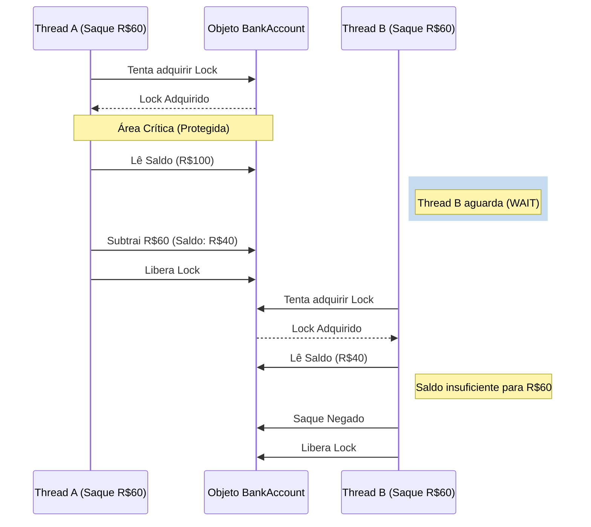
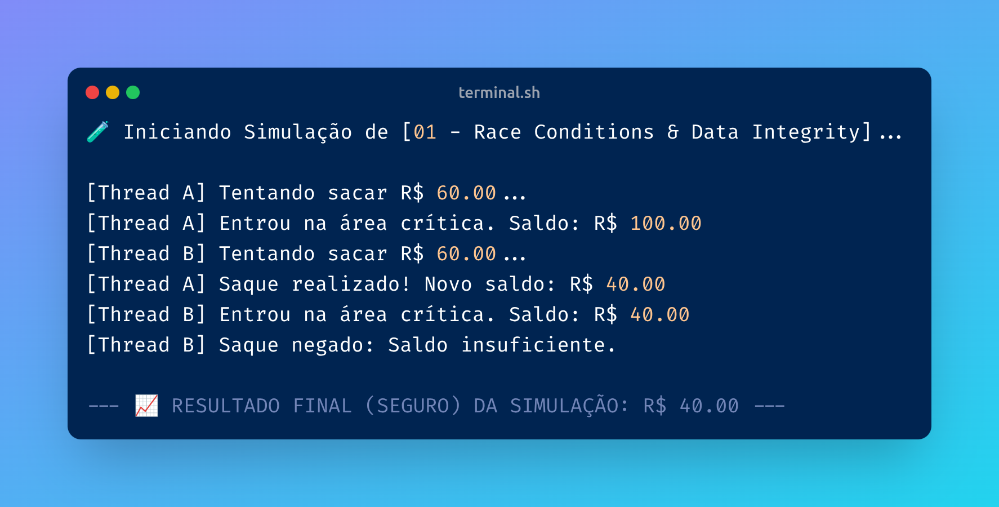

# 01 - Race Conditions & Data Integrity

## O Problema
Em sistemas que processam pagamentos simultâneos, pode ocorrer uma "Condição de Corrida", onde duas threads leem o mesmo saldo antes de uma delas atualizá-lo, resultando em dados inconsistentes (ex: saldo negativo indevido).

## 📊 Visualização do Fluxo (Lock)


## O que foi aprendido:
- **Área Crítica:** Identificar trechos de código que manipulam recursos compartilhados.
- **Mutual Exclusion (Mutex):** Uso de `Lock` para garantir que apenas um processo altere o dado por vez.
- **Atomicidade:** Garantir que uma transação ocorra por completo ou não ocorra.

## Como rodar o experimento
```bash
python 01-race-conditions/secure_implementation.py
```

## 🖥️ Resultado no Terminal
Evidência da execução garantindo a integridade:

