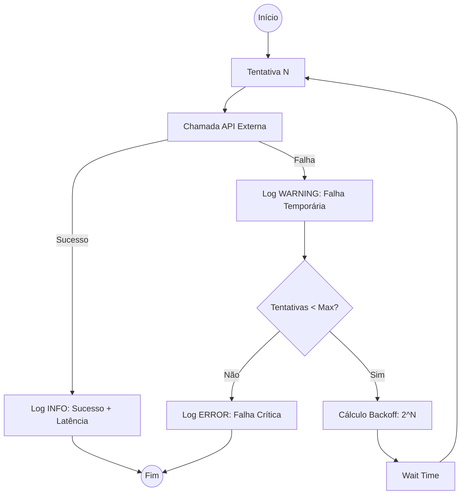
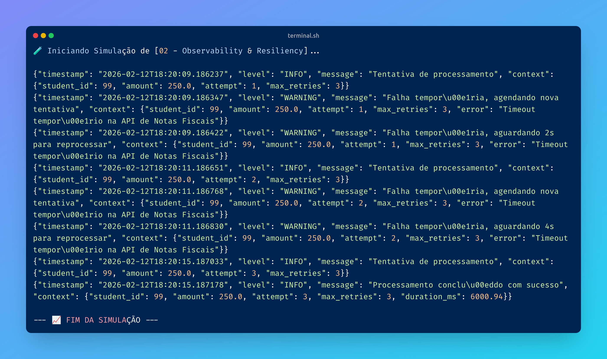

# 02 - Observability & Resiliency

## O Problema
Logs de texto simples são difíceis de analisar em larga escala. Além disso, sistemas que não tentam se recuperar de falhas temporárias (retries) são frágeis.

## 📊 Visualização do Fluxo (Retry & Backoff)


## O que foi aprendido:
- **Structured Logging:** Uso de formato JSON para facilitar a busca e indexação de logs.
- **Contextualização:** Injeção de metadados (`student_id`, `attempt`) para rastrear o fluxo completo.
- **Retry Logic:** Implementação de retentativas inteligentes com distinção entre falhas temporárias e críticas.

### Resiliência Avançada: Exponential Backoff
Implementei a estratégia de **Backoff Exponencial** para as retentativas. Em vez de sobrecarregar o serviço externo com tentativas em intervalos fixos, o sistema aumenta o tempo de espera progressivamente. Isso evita o fenômeno de "Thundering Herd" e aumenta as chances de sucesso conforme o serviço externo se estabiliza.

## Como rodar o experimento
```bash
python 02-observability/resilient_logging.py
```

## 🖥️ Resultado no Terminal
Aqui está a evidência da execução garantindo a resiliência e log de cada processamento:

