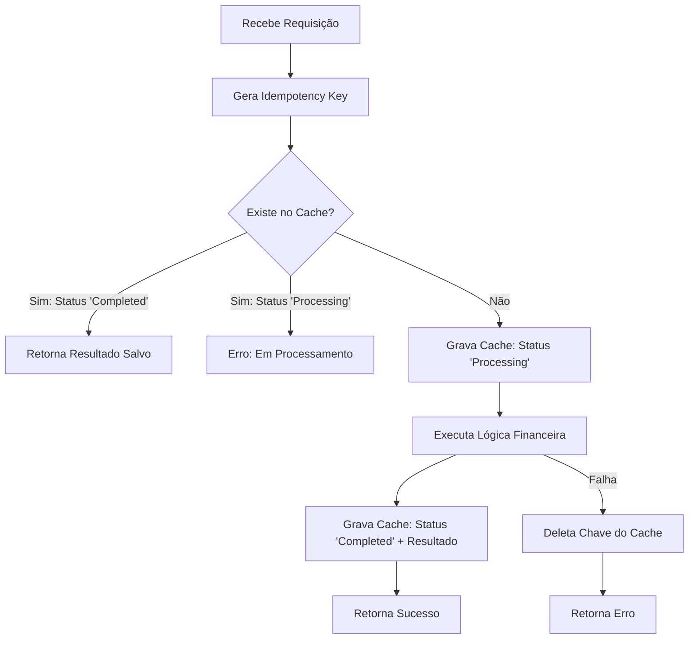
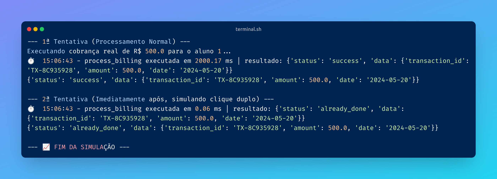

# 03 - Idempotency Pattern

## O Problema
Em sistemas financeiros, retentativas automáticas ou múltiplos cliques podem gerar cobranças duplicadas. A idempotência garante que realizar a mesma operação múltiplas vezes tenha o mesmo efeito que realizá-la apenas uma vez.

## 📊 Visualização do Fluxo (Check-Lock-Execute)


## O que foi aprendido:
- **Idempotency Key:** Criação de hashes únicos para identificar requisições idênticas.
- **Fluxo Check-Lock-Execute-Update:** 
    1. **Check:** Verificar se a chave existe no cache.
    2. **Lock:** Marcar como processando.
    3. **Execute:** Realizar a transação pesada.
    4. **Update:** Guardar o resultado final para responder requisições futuras instantaneamente.
- **Fail-safe:** Remoção da chave de trava em caso de falha para permitir recuperação.

## Como rodar o experimento
```bash
python 03-idempotency/idempotent_engine.py
```

## 🖥️ Resultado no Terminal
Aqui está a evidência da execução garantindo a consistência para requisições repetidas:

