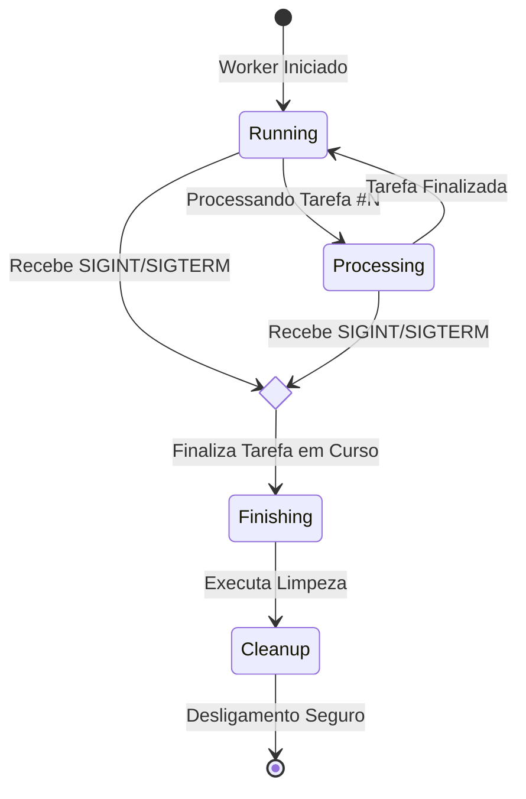

# 04 - Graceful Shutdown

## O Problema
Processos interrompidos abruptamente durante deploys ou reinicializações de servidor podem causar corrupção de dados ou estados inconsistentes em transações financeiras.

## 📊 Visualização do Fluxo (Sinais do SO)


## O que foi aprendido:
- **Sinais do SO:** Captura de sinais `SIGINT` (interrupção) e `SIGTERM` (término).
- **Flag de Controle:** Uso de variáveis globais para impedir o início de novas tarefas enquanto finaliza a tarefa atual.
- **Resiliência em Deploy:** Garantir que o Worker termine o boleto atual antes de permitir que o container seja destruído.

## Como rodar o experimento
```bash
python 04-graceful-shutdown/graceful_worker.py
```