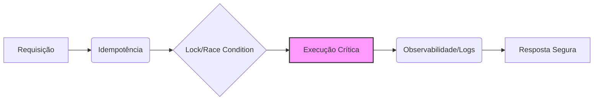

# Software Engineering Laboratory 🧪

  

Este repositório é um laboratório prático de conceitos avançados de engenharia de software aplicada ao mundo real (Backend/Fintech). 

O foco está na resolução de **gargalos de sistemas de alta criticidade**, onde a integridade dos dados e a disponibilidade são inegociáveis.

## 🛠️ Tecnologias e Conceitos
- **Linguagem:** Python 3.10+ 
- **Arquitetura:** Concorrência, Observabilidade, Resiliência, Idempotência e Signal Handling.

## 📂 Estrutura do Lab
- `01-race-conditions`: Prevenção de inconsistências em acessos simultâneos usando Mutex/Locks.
- `02-observability`: Implementação de logs estruturados (JSON) e estratégias de Retry com Exponential Backoff.
- `03-idempotency`): Design de sistemas que evitam duplicidade de transações através de chaves únicas.
- `04-graceful-shutdown`: Manipulação de sinais do S.O. para encerramento seguro de workers sem perda de dados.

## 🧪 Módulos do Laboratório
| Módulo | Descrição | Conceitos Chave | Link |
| :--- | :--- | :--- | :--- |
| **01** | Race Conditions | Mutex, Locks, Atomicidade | [Ver Detalhes](./01-race-conditions) |
| **02** | Observability | Logs JSON, Backoff, Resiliência | [Ver Detalhes](./02-observability) |
| **03** | Idempotency | Check-Lock-Execute, Hashes | [Ver Detalhes](./03-idempotency) |
| **04** | Graceful Shutdown | SIGINT/SIGTERM, Cleanup | [Ver Detalhes](./04-graceful-shutdown) |

## 📊 Visualização do Fluxo (Geral)


## 🚀 Como Executar
O projeto utiliza um orquestrador central para facilitar os testes de cada módulo:

```bash
python main.py
```

## 🖥️ Resultado das Simulações
Abaixo, a execução sequencial garantindo que cada padrão de design cumpra seu papel:

